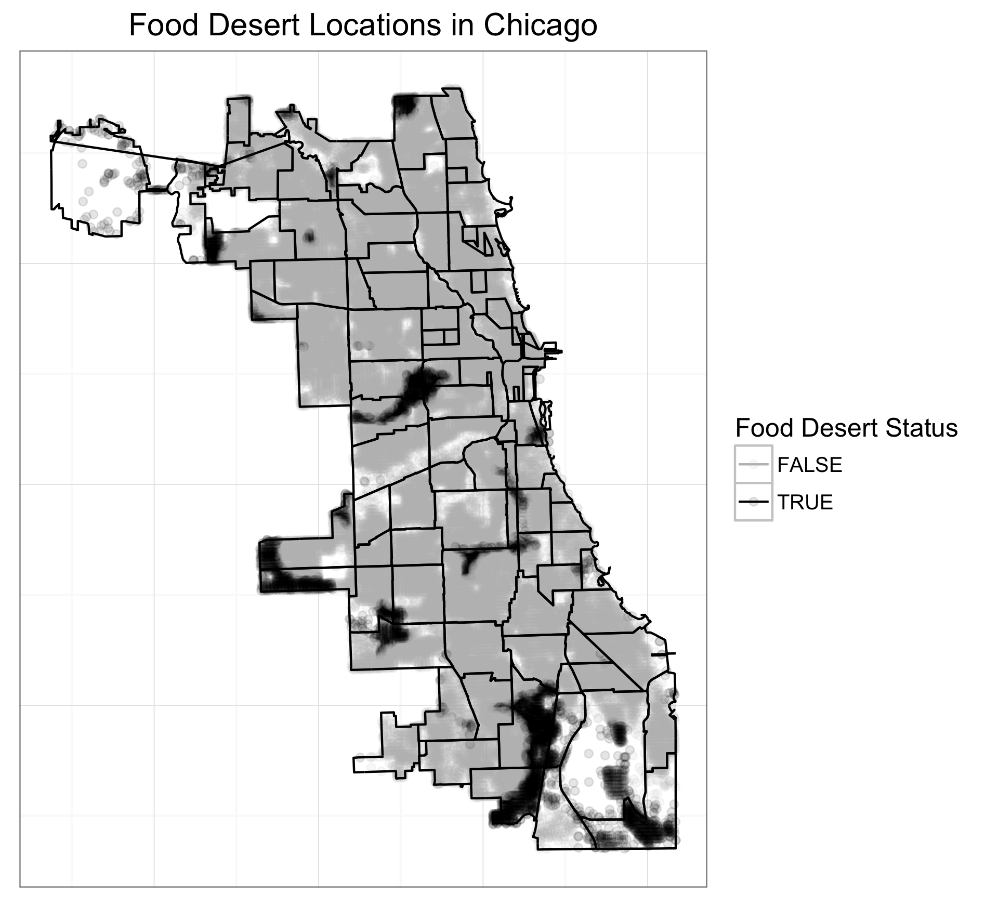
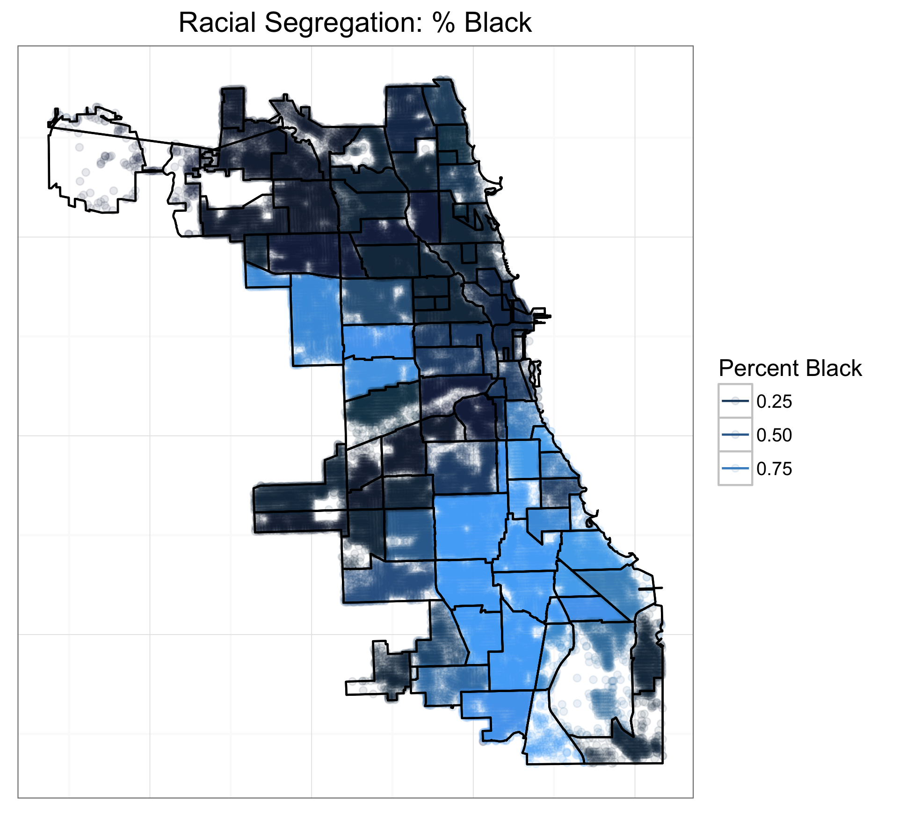
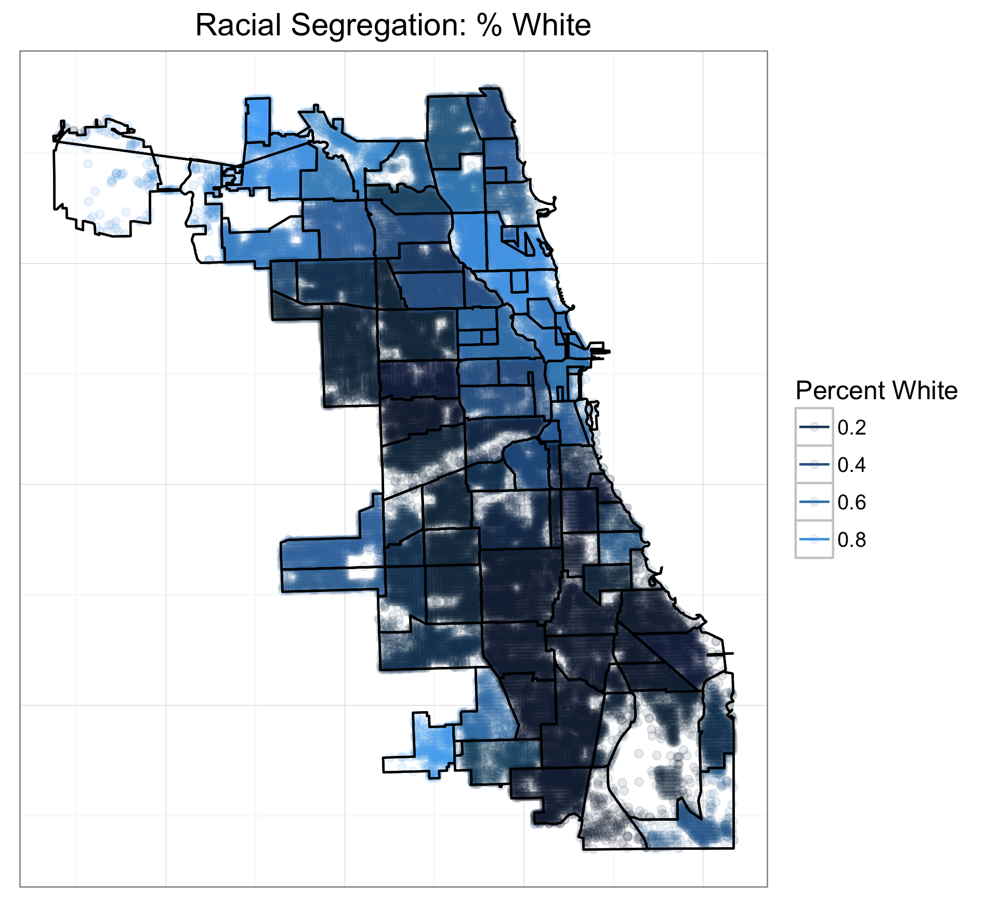
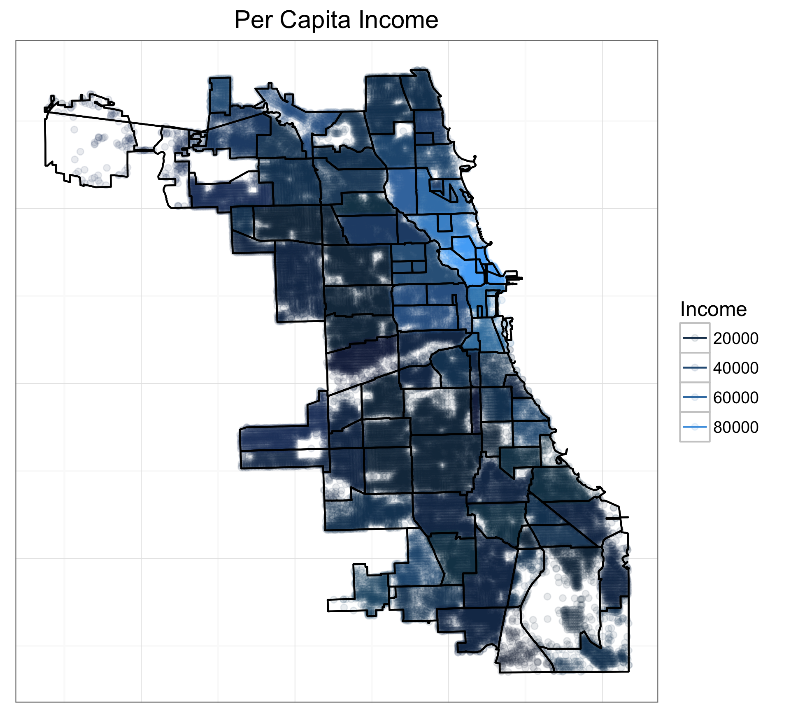
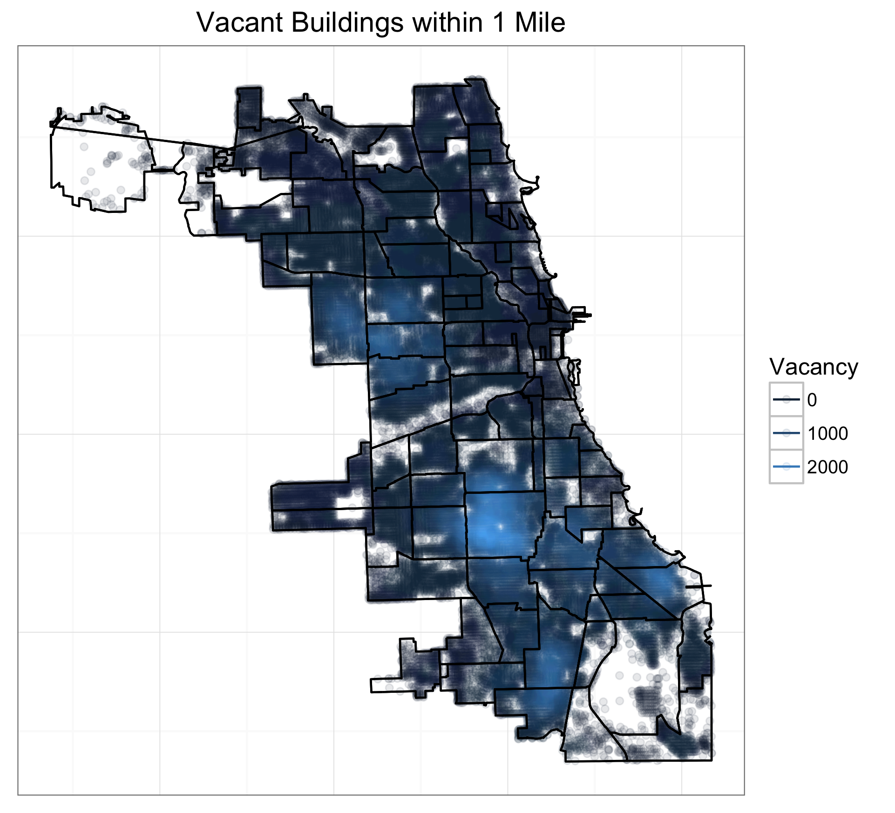

---
title: "Food Deserts in Chicago"
author: "Daniel Berry"
output: revealjs::revealjs_presentation

--- 

# Introduction

## What is a Food Desert? 
- In general: a place where it is more difficult to access healthy food
- Defiition used for this work: a city block located more than 1 mile from a supermarket
	- Supermarket defined as a grocery store larger than 10000 sq ft
	- Distance is great circle distance between center of grocery store and center of city block
	- Other definitions exist that also cover rural areas and take into account car ownership (harder to travel w/o a car)

## Where are food deserts in Chicago
```{r, include = FALSE}
load('all_data')
```
```{r, out.width = "600px", echo = FALSE}

```

## Number of people living in a food desert
According to the data and methodology used, estimate `r sum(all_data[all_data$desert, 'TOTAL.POPULATION'], na.rm = TRUE)` people living in a food desert. This is similar, but not exactly the same as previous estimates. In fact, other studies give a higher estimate. 

# Chicago Demographics

## Distribution of Black People

```{r, out.width = "600px", echo = FALSE}

```

## Distribution of White People

```{r, out.width = "600px", echo = FALSE}

```

## Income 

```{r, out.width = "600px", echo = FALSE}

```

## Vacancy 
```{r, out.width = "600px", echo = FALSE}

```

# Data 

## Source
All data from the [Chicago Open Data Portal](https://data.cityofchicago.org). Several files:

- Crimes 2001 - Present 
- 311 Service Requests - Vacant Buildings
- CTA Ridership Avg Weekly Boardings Oct 2010
- City Block Population
- Public Health Statistics Selected Indicators 
- Census Data: Selected Socioeconomic Indicators
- Race by Community Area

# Models 

## Complete Pooling
 
$$ y_{ij} = \text{logit}^{-1}\left( \alpha + X_{B}\beta_{B}  \right) $$

## No Pooling

$$ y_{i} = \text{logit}^{-1}\left( \alpha + X_{B}\beta_{B} +  \gamma_j  \right) $$

## Partial Pooling 

$$ y_{i} = \text{logit}^{-1}\left( \alpha_{j[i]} + X_{B}\beta_{B}  \right) $$

Where $\alpha_j \sim N(\mu_\alpha, \sigma^2_\alpha)$

## Hierarchical

$$ y_{i} = \text{logit}^{-1}\left( \alpha_{j[i]} + X_{B}\beta_{B} +  \epsilon_i \right) $$
Where $\alpha_j \sim N(X_N \beta_N, \sigma^2_\alpha)$

# Model summaries 

## Complete Pooling

```{r, echo = F}
library(lme4)
load('cp')
summary(cp)
```

## No Pooling 

```{r, echo = F}
load('np')
summary(np)
```

## Partial Pooling 

```{r, echo = F}
load('pp')
summary(pp)
```

## Hierarchical

```{r, echo = F}
load('mlm')
summary(mlm)
```

# Results 

## Was pooling effective?

- Variance ratio $\approx 3$ indicates much higher variability within a neighborhood than between neighborhoods. 

- AICs for random intercept models were higher than no pooling model. 

- Cross validated MSEs (or [Brier Scores](https://en.wikipedia.org/wiki/Brier_score)) were a way to quantify how accurate we are on previously unseen city blocks within a neighborhood: 
	- Complete Pooling:  0.07382216 
    - No Pooling: 0.05328587 
    - Partial Pooling:  0.05329956 
    - Hierarchical: 0.05323632 

## Thoughts

- Models are an improvement over just using neighborhood level variables, but I'm not convinced that the hierarchical model is an improvement over simpler no pooling or partial pooling. 

- Unfortunately this project doesn't really give us any more information about the causes of food deserts that we didn't really know before. More importantly this project doesn't help resolve the issue at all. 

# Questions?
